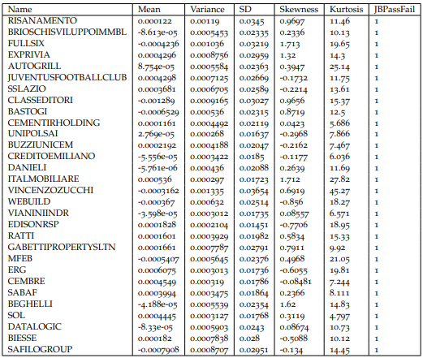
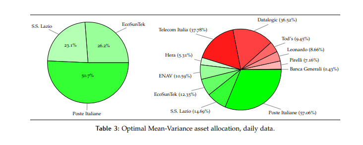

# the-italian-job

In what follows, we are going to compare the Mean-Variance, Black-Littermann, Pure Bayesian and Global Minimum Variance asset allocation methods applied to a pool of Italian stocks to determine their perfomances, pros and cons.

First of all, we should decide whether to use linear or continuously compounded returns. We chose the latter for two reasons: compounded returns are stripped of the information about the time interval between observation, and therefore they are much more consistent when forecasting and projecting data as it is our case. 

Furthermore, this choice allows us to be consistent with the Black-Scholes-Merton model, which is a very effective (although not perfect) representation of the stock market, where prices behave as a geometric Brownian Motion, and their rate of change is therefore distributed as a gaussian random variable. 

Real returns unfortunately are not distributed like gaussian random variables, and we can test this using the Jarque-Bera test for normality.

We are now ready to look at our pool's statistics.

The variable JBPassFail is a flag which is up when we reject the null hypothesis in the Jarque-Bera test and it is down otherwise. As it is common knowledge, daily returns are not normally distributed. The stock with highest mean return is Alerion Clean Power, with an impressive 0.1233% daily average return, while the worst performer is Class Editori, yielding on average −0.12894% daily. Terna is the safest stock in the list, while the riskiest stock is Pininfarina. Now we observe monthly data.

Here things change somewhat. We note that we have several stocks that now are considered normal by the Jarque-Bera test, but not all of them. We think that this is mostly due to the time frame of our analysis: several powerful shocks affected the market, such as the 2020 pandemic lockdowns and the 2022 energy crisis, therefore increasing kurtosis in the data considerably. Again, the stock with highest mean return is Alerion Clean Power, while the worst performer is Class Editori. Terna is again the safest stock in the list, while the riskiest stock in monthly data is Ecosuntek.

The correlation and covariance analysis is crucial to our mean variance optimization problem: strong inverse correlation between assets is favorable, as theory dictates that when assets are
perfectly negatively correlated, risk can be completely diversified away. Clearly, the market has some level of interconnection among all of its assets, and no such perfect inverse correlation can be found. Still, the lower correlation we achieve the better. Unsurprisingly, the least correlation can be found between stocks belonging to different industry sectors and classes. 

The least correlation in daily data ρ = −0.0187 is found between Vianini Industria, a company whose main involvment is in the reinforced concrete and construction industry, and Enervit, a food supplement company. There is also a market cap component to correlation: large companies are usually more correlated with each other than they are with small companies.

The largest correlation between different stocks is found between Telecom Italia and Telecom Italia saving class, but this is not very useful. What really proves our point is that the highest correlation between truly different stocks is found between Intesa San Paolo and UniCredit (ρ = 0.8446), which belong to the same sector and they are both large cap companies. The least correlation in monthly data ρ = −0.3503 is found between Vianini Industria and Fidia.

In our selection of stocks for our portfolio we wanted to perform a scenario-based exercise. We put ourself in the position of an asset manager who is tasked to select some stocks which may cater to customers who are sensitive to the issues of the current world. This points us toward a strong ESG component in our portfolio, and our selection reflects ESG investing criteria. Our ESG data provider are S&P Global and Sustainalytics by Morningstar. Our selection criteria were as follows:

• We performed a worst-in-class screening, and therefore stocks which were considered
high to severe risk by Sustainalytics are not allowed in our portfolio

• At least half of our stocks must have been from companies awarded SAM Gold Class,
SAM Silver Class or Sustainalytics Negligible Risk Class

• We wanted at least one properly green stock, to reflect the will of our hypothetic customer
to do some thematic investing

• Remaining stocks should preferably come from companies awarded SAM Bronze Class
and Sustainalytics Low or Medium Risk Class

Among the stocks that meet our criteria, we then proceeded to pick those least correlated with each other, naturally leading to a procedure of diversification by industry sector. While this strategy may not yield the best portfolio in the traditional sense, there is some literature that tells us that in the long run sustainable investing produces an higher level of benefit for society at large. ESG rating methodology is quite consistent between the two providers, employing a scheme of anchors and modifiers to come to a final score. Our final choices were:

• Hera. Hera SpA is Italian energy and utilities holding company. As a holding company, Hera is a combination of public-service companies built into a single multi-utility entity. The company operates in environmental services (waste collection and treatment); energy services (distribution and sale of electricity and gas); and water services (waterworks, sewerage, and purification). Primarily, Hera operates in the provinces of Bologna, Rimini, Ravenna-Lugo, Forli-Cesena, and Imola-Faenza in northern Italy

• Leonardo. Leonardo is one of the largest European defense firms, with 30% of its shares owned by the Italian government. The group’s divisions include helicopters; defense, electronics, and security systems; and aeronautics. The helicopter division serves both military and civil markets through AgustaWestland. DES has access to the U.S. defense market through the DRS subsidiary. The aeronautics division cooperates in international programs such as Eurofighter Typhoon, F-35, and the new Tempest and supplies aerostructures to large commercial aircraft programs

• Pirelli. Pirelli & C SpA designs develop, manufactures and markets tires - for motor vehicles, industrial vehicles, and motorcycles. The company operates through Prestige, New premium, Specialties and Super Specialties, and Premium Motorcycle

• Poste Italiane. Poste Italiane SpA is an Italian diversified financial-services company. The company’s reportable segments are Mail, parcels, and distribution; Payments and mobile; Financial services; and Insurance services. The Mail, parcels, and distribution segment includes letter post, express delivery, logistics, parcels, and philately. This segment generates the most revenue for Poste Italiane SpA. Geographically, the company has a presence in Italy, but also elsewhere in Europe, the Americas, and Asia

• Telecom Italia. Telecom Italia is the incumbent telephone operator in Italy with more than 30% market share in the Italian mobile market and 45% market share in broadband. In the mobile market it competes with Vodafone, Wind Tre and Iliad. On the broadband side, its main competitor is Open Fiber, which operates a wholesale network giving equal access to several operators. TIM also has a 20% wireless market share in Brazil and has started building a broadband network in the country, although its reach is very small compared with its competitors Telefonica and America Movil

• Banca Generali. Banca Generali is a private bank that supports clients in the care and protection of assets with innovative and sustainability-oriented solutions. It is involved
in financial planning and asset protection of clients. It offers services such as Home
Banking; Online Trading; Mobile and Wearable Payments and C-less debit and credit
cards; Investment services and wealth management services. The company has more
than 45 branches and 170 offices in the main Italian cities

• EcoSunTek. Ecosuntek S.p.a. represents one of the fastest growing economic realities in
the renewable energy sector, boasting a track record of plants built on land and buildings
for a total power of approximately 150 MW, of which 42 MW owned

• ENAV. ENAV SpA is an air traffic controlling firm. The company’s operating segment
includes Flight assistance services; Servicing; AIM software solutions and Other sectors.
It generates maximum revenue from the Flight assistance services segment. Through its
segments, it provides air traffic control and management services and other essential air
navigation services to the Italian airspace industry. Geographically, it derives a majority
of revenue from Italy

• Tod’s. Tod’s SpA makes luxury shoes, leather goods, and apparel that it sells under
brands including Tod’s, Hogan, Fay, and Roger Vivier. Shoe sales account for more than
three fourths of the company’s total revenue. The company sells its products mostly
through directly operated company stores, but it also sells through franchised company
stores and independent multibrand stores. More than half of the company’s total revenue
is generated in Europe, with most of those sales coming from Italy. Other big markets
include China and the Americas

• SS Lazio. S.S. Lazio SpA is engaged in running and managing the S.S. Lazio soccer team.
It provides the organization of soccer matches, which includes the ticket sale, the sale of
television and radio rights for the match transmissions and rights

• Datalogic. Datalogic SPA is an Italy-based company that provides services to the data
capture and process automation markets. The company is organized into two business
units: Datalogic, and Informatics. The Datalogic business designs and manufactures
products such as bar code scanners and mobile computers. The Datalogic unit generates the majority of its sales. The Informatics segment manufactures and sells items and
solutions for managing inventories and mobile assets for small to medium sized companies. The firm has operations in the Americas, Europe, and Asia-Pacific, with most of its
revenue coming from Europe

We will now take a look at how the prices of our assets evolved in time. 

The plot
includes all of the prices on a log-scale, to facilitate comparisons between stocks whose order
of magnitude is different. Some facts are clearly visible in the graph: one might notice a sharp
drop in all prices in February 2020, right when the Italian government enacted the first "Io sto
a casa" lockdown decree. Also, we have some lines that do not start at the beginning of our
time frame: these are the companies which were not listed yet as of January 2015.

The optimal mean-variance portfolio is obtained as a result of two distinct optimization problems. The first one is a typical min Q problem, where a quadratic form has to be minimized
over a linear (or affine) domain. Formally, the unconstrained min Q problem that describes our
efficient frontier is stated as

Then we may maximise the Sharpe ratio to select an optimal portfolio along the frontier:

A further constraint may be added if we choose not to allow short selling, thus yielding the
problem

Then, we may still proceed by maximising the Sharpe ratio. Such procedure yields the results
shown in tables. 

The pie charts slices show the overall volume linked to a certain
stock: in red we have the volume generated by short operations, in green we have the volume
generated by long operations. We can see that Poste Italiane constitutes the majority of the portfolio where short selling is
not allowed, with EcoSunTek and S.S. Lazio completing the allocation in roughly equal parts.

We see that when we disallow short selling, our optimization process favors the strongest
performers among our group, to a point where only three stock are selected for our portfolio.
When we allow for short selling, we see that our optimal strategy is a rather aggressive one
(long to short budget usage is approximatively 570 − 470 for the daily case and 625 − 525, in
contrast to industry standards such as 110 − 10), with an allocation that requires a strong short
position on the worst performers of the group. We will see in further analysis how this impacts
the behavior of the portfolio. We now check some summary statistics about our portfolio:

As expected, short selling pushes the risk envelope, yielding higher risk and higher expected
returns. Returns for both portfolio do not pass the Jarque-Bera test for normality, but this is
normal for daily returns. What is most surprising is that the short selling portfolio has less
kurtosis than the no short selling one: we feel that this is due to better diversification and show
the hedging potential that a short position may have if employed correctly.

We can plot now the efficient frontiers for our portfolios.

What emerges is that the
efficient iso-utility curve for the unconstrained case sits higher than the no short selling one:
this is to be expected, as further constraints can only reduce the level of utility that a portfolio
may achieve, never increase it. We also see that we have some assets that sit really close to the
frontiers, and they happen to be among those that our allocation requires to buy the most. Our
optimal portfolio are also tangency portfolios: in this analysis (and all those that will follow,
except for the SML line plotting) we are assuming that no risk-free returns may be achieved.
Close to the blue line, which is the no short-selling efficient MV frontier, we have the assets
S.S. Lazio, Ecosuntek and Poste Italiane, the only three that constitute our optimal portfolio.
Ecosuntek appears to be an efficient asset on its own, within a minimal margin. One should
note that quadratic programming problems are typically solved through numerical methods,
especially if further constraints are set: this means that the asset manager should be extra
careful in evaluating the output of his software, and should always rely on his discretion in
this sense.
Despite an outlandish aggressiveness, our unconstrained portfolio perform exceptionally
well: this is not to say that we have struck gold. One should always remember that in-sample
(i.e backtested) performance should never be considered as the ultimate performance metric,
as it is biased by construction. After all, hindsight is always perfect.

We now pick an index as a benchmark for our portfolios. We notice that
among our selection of stock there are both small-cap and large-cap companies: it would be
unwise to use the FTSE MiB as our benchmark as it would not really capture the behavior
of the small-cap component. For this reason, we choose the FTSE Italia AllShare, in its total
return form (although we also reported one price index, for the sake of completeness). The
choice of a TR index fits well with our scenario-based approach to the analysis: TR indexes are
cum-dividend, and dividends obviously accrue to the stockholder.

We see that the market as represented by our index is less profitable and less risky than our
portfolios. This is due to the particular selection of stocks that we performed, although one may
have originally expected an ESG driven portfolio to perform better as far as risk is concerned.
While the market in itself is not a tradeable asset, we have the so called smart-beta and index
funds whose main objective is to track the behavior of the market while keeping management
costs really low. From a pure performance point of view, these ETFs are suboptimal, but often
times their attractiveness lies entirely in the low costs (usually around 50 basis points per
annuum).

Even with monthly frequency we see that our returns do not pass the Jarque-Bera test for
normality. This doesn’t surprise us at all. To put in perspective how catastrophic the lockdown
crisis has been, we may evaluate the odds of experiencing an event at least as intense under
the normality assumption. This would be the same as calculating the probability that a normal
with parameters µFITASHE and σFITASHE exceeds 26.37% in absolute value. This probability
is around 1.5 · 10−6: if we flipped a rigged coin with this probability of getting head once a
month, we would see one head on average once every 55000 years. Clearly, this provides a
strong indication that monthly returns are not normal, same as daily ones.

We are going to evaluate betas for our assets and our portfolios. The CAPM is a single factor
linear pricing model, with that single factor being the market performance. This means that
two parameters are needed to explain and forecast returns: the regression coefficient for the
constant (also known as Jensen’s alpha) and the regression coefficient for the excess return
with respect to the market, called beta. The formula for beta is the usual regression formula:

Securities with beta higher than one are usually considered aggressive, as (should the model
be predictive enough) when the market goes up, the security goes relatively better than the
market, and similarly we can describe the behavior of the security as the market goes down,
mutatis mutandis. Securities with beta lower than one are considered defensive, as they attenuate the market behavior instead of amplifying it, with mechanisms similar as those described
before. Here we have the result of our calculations.

As we will see shortly, while the CAPM is widespread in the industry and has strong theoretical foundations, it really cannot capture the market behavior very well. Further evolutions
have been proposed, mainly increasing the number of factors (see for example the work of Fama and French).

The Security Market Line is a graphical representation of the CAPM. It is none other than the
line having the regression equation

where beta is considered as the independent variable. Note that Jensen’s alpha is missing:
the general theory says that alpha should be zero, as no excess return with respect to the risk
free rate should be obtained without accepting any risk (one might also say that an arbitrage
opportunity would arise). Should the CAPM be accurate, all securities should lie on the
SML. We plot the SML for our portfolios and the securities Leonardo and EcoSunTek. We are
assuming a risk free rate of 50 basis points per annuum. This yields the daily and monthly
equivalent rates

One should always remember that it is more appropriate to evaluate daily quantities using a
factor of 252, as that is the number of trading days in a year.

As we feared, the CAPM fails to predict accurately returns for our assets and portfolio.
There are two possible interpretations for this fact: either one trusts the CAPM to be correct and
states that the assets are misvalued by the market, prompting oneself to buy or sell a certain
security, or one may take this as a sign that the CAPM is insufficient in correctly pricing assets.

The traditional mean-variance approach has a serious limitation: while the calculations are
rooted in concepts which are solid and agreed upon by the financial community (that are, risk
is measured by some coefficients of dispersion, benefit is measured by some coefficients of location and utility is maximized when benefit is high and risk is low), serious problems emerge
when we need to estimate the parameters to be employed. First of all, a considerable number
of observation is required to obtain good convergence of our estimators, but the number of
observation is usually directly linked with the passage of time, meaning that many observation may be relative to a state of the market which is no longer relevant, or even worse, those
observation may simply not exist. Furthermore, the opinion of the investor is very relevant
in making decisions, and classical estimation methods do not allow for a rigorous procedure
for taking them into account. The Black-Litterman approach solves these problems: under a
Bayesian framework, the investor is able to express his linear expertise, that is he can express
his feelings about the market by mean of linear relations between quantities. In practice, this
linear expertise is expressed through the equation

where P is called pick matrix, and it contains the absolute and relative relations between asset
returns, µ is the return vector and ν is the view column, quantifiying the investor opinion. The
investor then has to state his level of confidence in his expertise: this information is contained
in a symmetric matrix Ω, which acts as the prior distribution covariance matrix. Ω may be
chosen to be diagonal, in which case there is not cross-uncertainty between views. Assuming
normality for all of our model, we may state the views distribution As

where usually Ω = diag(τPΣP′), with τ being a confidence parameter. Note the recurrent use
of word such as typically or usually: the Black-Litterman model allows for immense flexibility.
The confidence parameter is typically related to the inverse of the number of observation:
knowing what is the best practice, we set an arbitrary value of 1/2, which according to Meucci,
is the same as saying that the investor trusts his expertise just as much as the market data. This
is beacuse we want to exacerbate the effects of our views, for didactic purposes. Using these
information one arrives to the distributions for the asset moments:

where µeq is assumed to be a return vector relative to a market equilibrium. In fact, what
this model does, is to assume that the CAPM holds true a priori. From this point on, all
that remains is to peform the usual mean-variance optimization. We are assuming that our
short-selling allowed mean-variance asset allocation is relative to a market equilibrium. An
alternative procedure could have been that of tracking a market index with our assets using a
least-squares approach, and using implied returns for our market equilibrium. Our views are
as follows (annualized percentages):

• Hera will grow 10%

• Leonardo will grow 15%

• EcoSunTek will outperform Pirelli by 35%

• Datalogic will outperform Tod’s by 20%

• ENAV will fall 10%

Here are the resulting asset allocations

These allocation reflect quite well our views. In fact our posterior locations are:

Notice how, for example, the posterior return for Leonardo is increased, while the gap between the returns of EcoSunTek and Pirelli is increased. The dispersions are also altered.

Our views led to portfolios with increased risk overall and reduced performance: this is
an indication that the investor was overconfident in his wrong views. That is exactly what
we wished to see by setting an arbitrary (and very high) level of confidence in the views.
Furthermore, the considerations about the validity of in-sample performance metrics are still
valid: the true strength of the Black-Litterman approach emerges in out-of-sample situations,
where the expertise of the investor is not beaten by hindsight. Annualized sharpe ratios (SR = µ/σ) are 0.4516 for the portfolio obtained with daily data and 0.5370 for the portfolio obtained
with monthly data.

While the Black-Litterman approach is exceptionally flexible in taking into account the investor
views, it is still limited in that it doesn’t allow to form explicit views on the asset covariance.
A pure Bayesian approach allows us to overcome this limitation, paying the price of not being
able to specify views with the accuracy that the Black-Litterman approach provides. In our
case we will suppose a normal conjugate and prper prior for the location index of our distribution and a degenerate distribution for the dispersion, assuming that it is known and certain.
An alternative approach could have been that of supposing the normal-inverse-Wishart prior,
which better accounts for uncertainty in the dispersion. Our standard Bayesian approach then
starts from the normal prior

where ˜µ is obtained by adding a standard deviation to the assets mean and Σ˜ is obtained by doubling the assets covariance matrix. By the Bayes theorem

one obtains

Alternatively, one might use the Jorion estimator. It is obtained by
shrinkage estimation, starting from

to obtain

Then we shall proceed with a typical MV optimization.

In the tables we can see how the bayesian update mechanisms altered our moments.

The high number of observation reduces considerably the impact of the prior on the blended distribution: when working with daily data, we have that ∥wmv − mBayes∥∞ = 0.0045, implying that all the allocation choices differ at most for a quantity which is lesser than half a percent point between the traditional mean-variance and the standard Bayesian. When utilizing monthly data, we have ∥wmv − mBayes∥∞ ≊ 8 · 10−6.

The portfolio obtained with daily data has an annualized Sharpe ratio of 0.8469, while the
portfolio obtained with monthly data has a Sharpe ratio of 1.0034.

The global minimum variance portfolio is obtained by looking for the portfolio which realizes
the lowerbound for risk among the unconstrained efficient portfolios. Graphically, it is the
apex of the efficient frontier parabola. The GMVP is obtained by performing a minimization
along the constraint given by the frontier, the mathematical tool which allows us to solve this
problem is the method of Lagrange multipliers.

As shown above the asset allocation is substantially different from those obtained mazimising
the Sharpe ratio along the frontier. Obviously, this is the safest portfolio among those we
discussed.

The portfolio obtained with daily data has an annualized Sharpe ratio of 0.078, while the
portfolio obtained with monthly data has a Sharpe ratio of 0.1443.

We have seen serveral methods for asset allocation, each with its own strengths and weaknesses.
The first was the traditional mean-variance optimization method, where decisions were taken
purely on the basis of historical data. This method is built on the basis that investors are
mean-variance decisors: this may prove to be somewhat restrictive. Newer methods suggest
that investor utility should take into account skewness and kurtosis as well. While none of the
other methods works on the assumption that investors are mean-variance-skewness-kurtosis
decisors, it is still something worth noting. The worst pitfall however, is not in how utility
is measured, but it is in how parameters are estimated. In our analysis we had at least 1200
days (or circa 60 months) worth of observations for all assets, and while this is a considerable
amount, there is some literature suggesting that this is still far from enough. Furthermore,
data cannot express the investor’s opinions about the future. This is what the Black-Litterman
approach tries to solve, with limitation of its own. It is based on the assumption that a true
market equilibrium exists and is observable, basically taking the CAPM for granted before
going on. Then, there is the issue of uncertainty about the views: while we used Meucci’s
empirical bayesian approach to measurement of views uncertainty, we have no guarantee that
we could not achieve better results by manually stating our degree of uncertainty. In a sense,
Black-Litterman immense flexibility is also part of its weakness, as the asset manager has to
make lots of extra assumption. The literature is a bit scarce even when it comes to choosing
the right global reliability factor τ. We purposedly picked an extreme value to emphasize the
effects of the Black-Litterman process, and while it is common practice to pick the inverse of
the number of observations, this is another parameter where investor discretion is required.
Another way to tackle the estimation bias is to use a Bayesian approach. On paper, it has
all of the benefits of the Black-Litterman method while being very general (after all, BL is a
particular case of Bayesian estimation), but this is where problems may arise. Except for a very
restrictive family of distributions (most notably the Gaussian distribution), the prior-posterior
update mechanism proves to be analytically intractable. While our choice of a normal prior
with certain variance made calculations easy, it is far from being truly representative of the
market, especially at daily frequency. Return may have a very complex distrbution (for example, see the generalized skewed T distribution, proposed by Theodossiou in 1998), and the update
mechanism may be solved only through numerical approximations, opening to a whole new
class of problems in numerical analysis that add further complexity to our allocation problem.
And we have still (hyper)parameters to be chosen where investor discretion is called to action.
We have seen how the GMVP allows us to take the least risks when building a portfolio but
it is far from optimal: using the Sharpe ratio as a performance metric, we see that it does not
score very high compared to other portfolios. It is still interesting as a theoretical construct,
that further shows that mean-variance optimization is a convex quadratic programming issue.
We are now going to consider one last portfolio, made blending our four optimal portfolios in
equal parts.

The allocation choices reflect the similarity between Bayesian and traditional MV portfolio,
biasing this new allocation towards that direction.

The summary statistics show a portfolio exactly in between the extremes given by the four
constituent ones. Annualized Sharpe Ratios are SRdaily = 0.8115 and SRmonthly = 0.9641.
At the end of the day, finance is not an exact science. Decisions are made by people which,
despite their best attempts, will never be completely rational. This means that while statistics
and performance metrics try to give us something objective and observable, the human factor
has still the last word on every decision, maybe chosing to trust a method over another because
of his personal experiences and beliefs. This analysis should however give a good impression
of some of the main issues and techniques which are typical of the asset management world.

